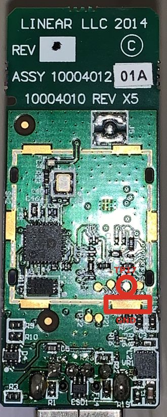

# husbzb-firmware

Zigbee coordinator firmware updater image for Nortek GoControl QuickStick Combo Model HUSBZB-1 (Z-Wave & Zigbee USB Adapter)

This docker image provides an environment to update the EmberZNet NCP application firmware from the older version 5.4.1-194 (or other old versions) that is shipped with the adapter to the latest publicly available EmberZNet NCP application firmware from Silicon Labs (6.6.5) or any other included version. 

Please submit a pull request to this GitHub reposotory with any other known working versions (older and newer).

**Note!** Please understand that as of September 2020, the 6.x.x releases and higher of SiLabs EmberZNet will require Home Assistant 0.115 or higher. 

## To use:
`docker run --device=/dev/ttyUSB1:/dev/ttyUSB1 -it walthowd/husbzb-firmware`

Replace */dev/ttyUSB1* with the path to the zigbee side of your USB stick. Make sure that nothing else is currently using the port (i.e. Shutdown and stop Home Assistant)

Example output, currently just a scan reporting current FW version: 
```
docker run --device=/dev/ttyUSB1:/dev/ttyUSB1 -it walthowd/husbzb-firmware
{"ports": [{"stackVersion": "5.4.1-194", "deviceType": "zigbee", "pid": "8A2A", "port": "/dev/ttyUSB1", "vid": "10C4"}]}
Found zigbee port at /dev/ttyUSB1 running 5.4.1-194
```

### Manual firmware update procedure
If you want to use this image to manually update your firmware first shut down Home Assistant, or any other program accessing the port.

Then start a shell from the docker image:

```
docker run --device=/dev/ttyUSB1:/dev/ttyUSB1 -it walthowd/husbzb-firmware bash
```
Make sure you are in */tmp/silabs* by changing directory and then flash:
```
cd /tmp/silabs
./ncp.py flash -p /dev/ttyUSB1 -f ncp-uart-sw-6.6.3.ebl 
Restarting NCP into Bootloader mode...
CEL stick
EM3581 Serial Bootloader v5.4.1.0 b962

Successfully restarted into bootloader mode! Starting upload of NCP image... 
Finished!
Rebooting NCP...
```
Wait for the stick to reboot, then run *ncp.py* again to verify upgrade
```
./ncp.py scan
Connecting to.. /dev/ttyUSB1 57600 True False 
{"ports": [{"stackVersion": "6.6.3-151", "deviceType": "zigbee", "pid": "8A2A", "port": "/dev/ttyUSB1", "vid": "10C4"}]}
```

### Coordinator migration
Latest versions of bellows support migrating from one coordinator to another. This allows you to move between sticks without resetting and rejoining all devices in your zigpy network. 

For seamless migration, you need to overwrite the EUI64 on your target adapter. This is a one time operation and can not be undone or changed in future (without a SWD flasher) so this should only be done if you are sure of the change. If you do not overwrite the EUI64 the binding tables on your devices will be incorrect and they will need to be reset and rejoined. 

For Elelabs adapters with hardcodes baud rates, you need to always add `-b 115200` as a paramter to bellows.  

NOTE: This is currently in testing mode.

To backup your existing configration:
```
docker run --device=/dev/ttyUSB1:/dev/ttyUSB1 -v .:/data -e EZSP_DEVICE='/dev/ttyUSB1' -e LANG='C.UTF-8' -it walthowd/husbzb-firmware bash
bellows info
bellows backup > /data/bellows-backup.txt
exit
```

Remove old stick, insert new stick (find correct ttyUSB port in `dmesg`) and restart container:
```
docker run --device=/dev/ttyUSB1:/dev/ttyUSB1 -v .:/data -e EZSP_DEVICE='/dev/ttyUSB1' -e LANG='C.UTF-8' -it walthowd/husbzb-firmware bash
bellows info
bellows restore --i-understand-i-can-update-eui64-only-once-and-i-still-want-to-do-it -B /data/bellows-backup.txt
bellows info
```
On subsequent `bellows info` runs check that the EUI64 matches your backup, that the PANID matches and that the trustCenterLongAddress addresses matches. If they do not match, re-run the `bellows restore` as `bellows restore -f -B /data/bellows-backup.txt` (Omitting the `--i-understand-i-can-update-eui64-only-once-and-i-still-want-to-do-it`)

### Selecting the correct firmware file

For integration with bellows/zigpy you will want the `ncp-uart-sw-6.6.5.ebl` image. This provides EZSP v7 support. Please note that the EM3581 has been deprecated by SiLabs and support has been dropped in future releases of EmberZNet. 

As of September 2020, hardware flow control is not supported by bellows/zigpy. Don't flash any of the images in the `hw-flow-control` folder unless you know what you are doing. 

### HUSBZB-1 Firmware Recovery

In the event of a bad flash or unexpected event, the bootloader for the EM3581 on the HUSBZB-1 can be accessed by resetting the stick and shorting TP17 to GND with a a serial connection (115200 8/N/1 no hw or sw flow control). On device startup, unshort TP17 and send a carriage return over the serial connection. You should be returned to the bootloader menu where a image can be uploaded via XMODEM. 


